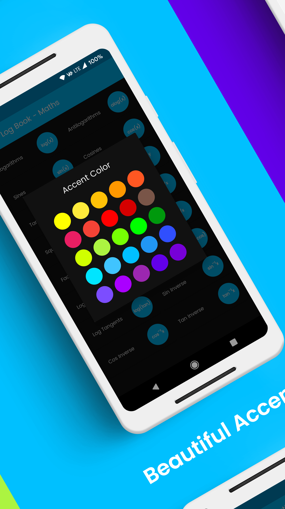
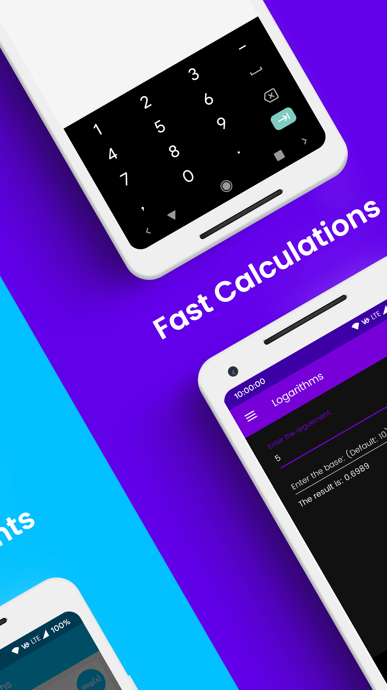
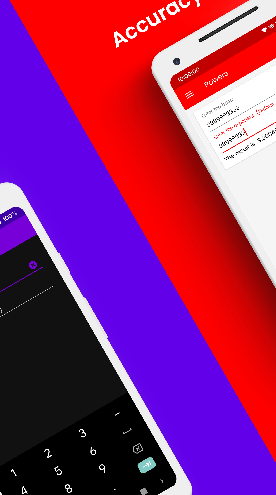
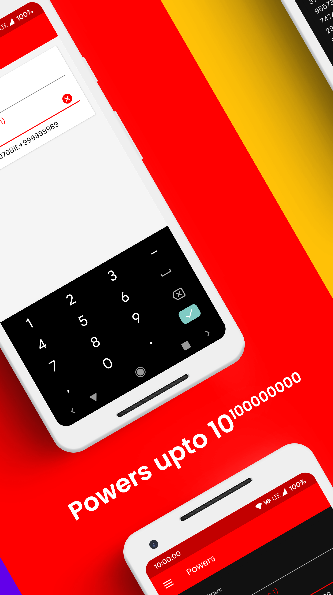
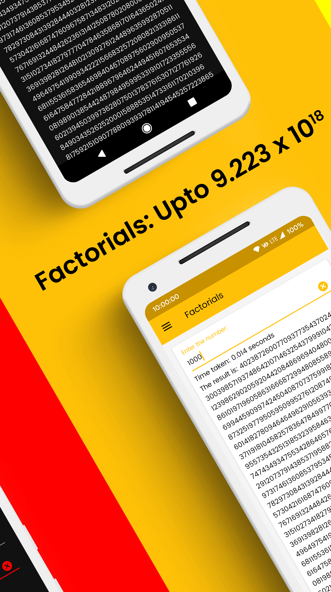
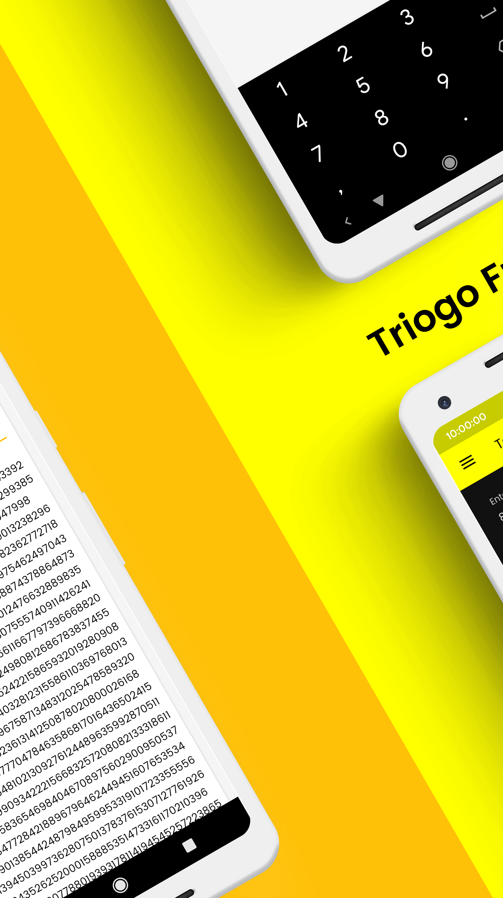
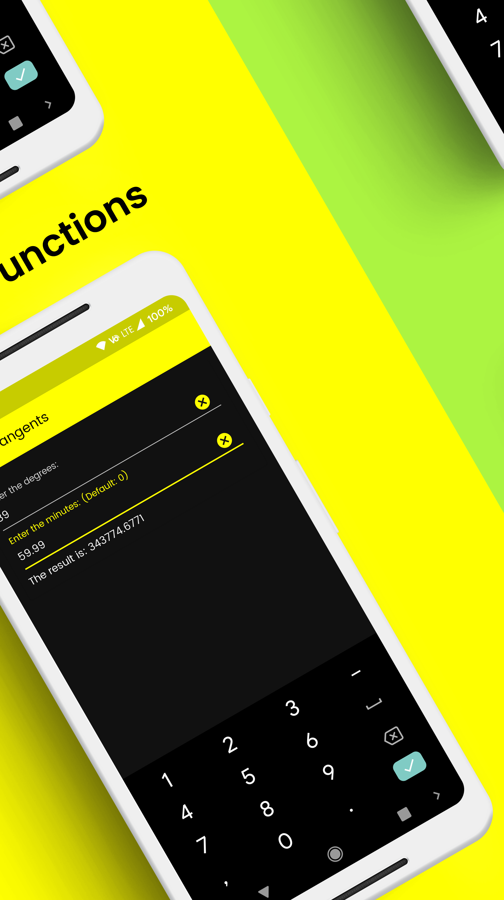
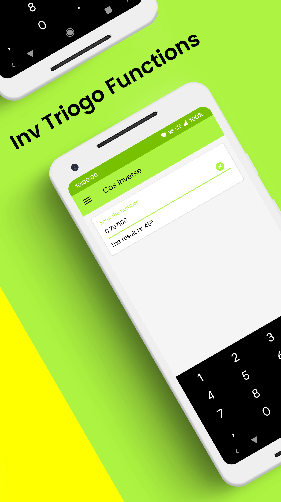

# [Log Book - Maths](https://play.google.com/store/apps/details?id=com.heethsapps.heeth.logarithmiccalculator)

## Overview

Log Book - Maths calculates logarithms, anti-logarithms, natural sines, natural cosines, and much more! No need to carry a log book and search through the logarithm, etc' s tables. Hard maths problems solved in seconds.

Uses:
- To calculate Maths problems related to logarithms, trigonometric ratios, reciprocals and much more.
- For school, college students.

Those tedious days are no more. Just enter the value, and the app will calculate the result for you. The app supports multi-window too so you never miss out on your work while using the app.

## Pros
- Ad free
- Fastest Calculation
- Long press on the result to copy it
- Change the decimal rounding places
- Calculate factorials up to 9223372036854775807
- Calculate powers, antilog up to 1.0E100000000
- Lots of powerful calculations
- Simple, Attractive and Responsive UI
- Multi Window Support

## Cons
- *None*

## Features
- Logarithms
- Anti-Logarithms
- Natural Sines
- Natural Cosines
- Natural Tangents
- Powers
- Factorials
- Reciprocals
- Logarithmic Sine
- Logarithmic Cosine
- Logarithmic Tangent
- Sine Inverse
- Cosine Inverse
- Tangent Inverse

## Screenshots

  
  
  
  

 

  
  
  
  

## License

    Apache License, Version 2.0

    Licensed under the Apache License, Version 2.0 (the "License");
    you may not use this file except in compliance with the License.
    You may obtain a copy of the License at

        http://www.apache.org/licenses/LICENSE-2.0

    Unless required by applicable law or agreed to in writing, software
    distributed under the License is distributed on an "AS IS" BASIS,
    WITHOUT WARRANTIES OR CONDITIONS OF ANY KIND, either express or implied.
    See the License for the specific language governing permissions and
    limitations under the License.